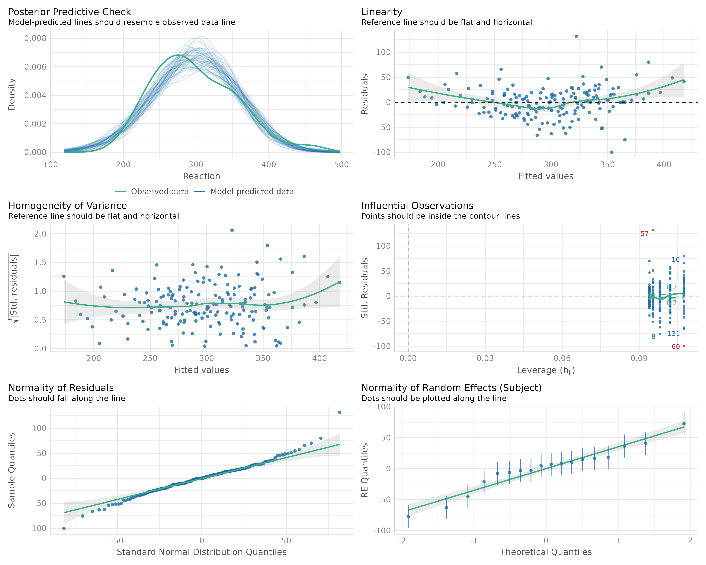
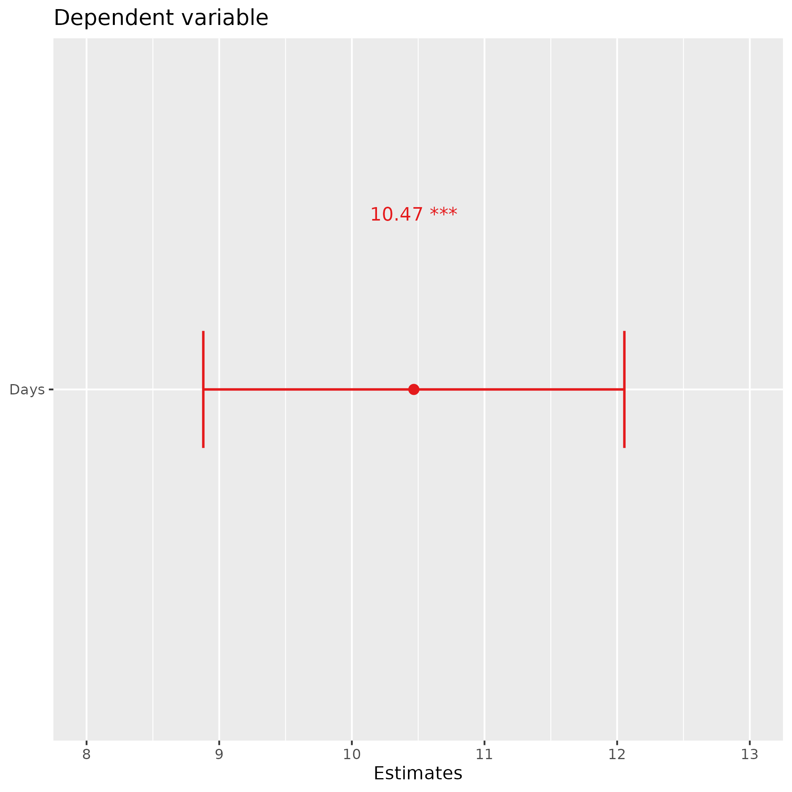
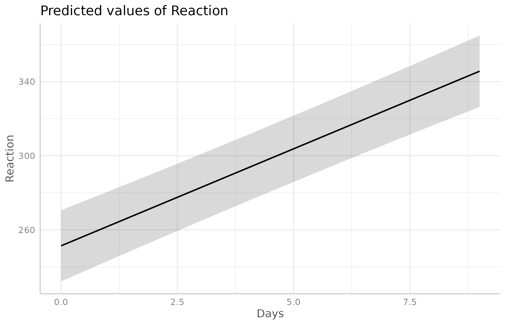
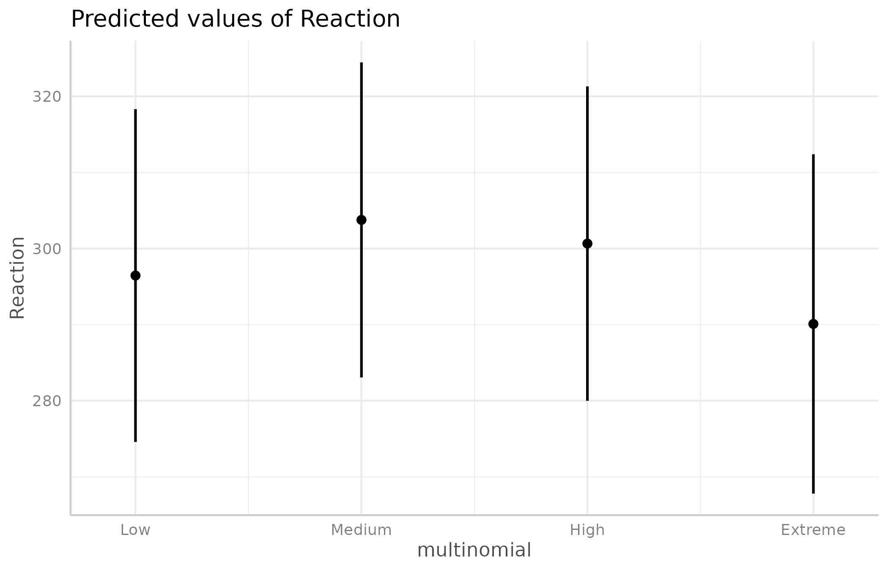
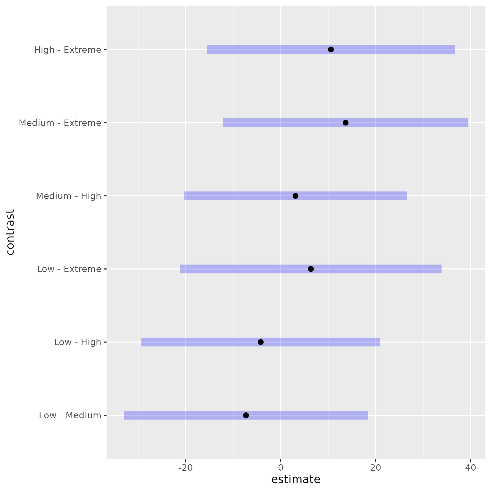

# Automated Mixed-Effects Model Fitting and Reporting in R

This repository contains an R function, `mixed_effect_lm()`, that automates the fitting of **linear mixed-effects models (LMM)** and **generalized mixed-effects models (GLMM)** using the `lme4` package.  
The function fits the model, generates a variety of **diagnostic plots**, **effect visualizations**, and **model summaries**, and saves them in a clean, sequential folder structure for easy reporting and reproducibility.

---

## ✨ Features

- ✅ Automatic installation and loading of required R packages  
- 📁 Creates a **new results folder** (e.g., `fit_01`, `fit_02`, ...) for each model run  
- 📊 Generates:
  - Diagnostic plots of model residuals and assumptions
  - Forest plots of fixed effects estimates
  - Effect plots for each predictor and for pairwise contrasts
- 📝 Exports:
  - Model summary as HTML report
  - Regression tables with contrasts in DOCX and PNG format
- 📦 Returns the fitted `lmerMod` or `glmerMod` object for further use

---

## 📌 Usage Example

Below is a minimal example using the built-in `sleepstudy` dataset:

```library(lme4)
data("sleepstudy")

model <- mixed_effect_lm(
    formula_lmm = Reaction ~ Days + (1 | Subject),
    dataframe = sleepstudy,
    where_to_save = "model_results",
    transform_coeff = "exp",
    family = "gaussian"
)

```

### 📊 Example Visualizations

The following plots are automatically generated and saved in the output folder:

1. **Diagnostic Plot**
<p align="center">
  
<p>
  
2. **Forest Plot**  
<p align="center">
  
</p>

3. **Effect Plot for Cuantitative Variables**  
<p align="center">
  
</p>

4. **Effect Plot for Cualitative Variables**  
<p align="center">
  
</p>

5. **Pairwise Contrast Estimates Plot**
<p align="center">
  
</p>

---

## 📝 Output Files and Directory Structure

Each run of `mixed_effect_lm()` automatically creates a new sequential folder (`fit_01`, `fit_02`, ...) inside the specified `where_to_save` directory.  
Within that folder, all plots and reports for that model are saved.

### Example structure:

```model_results/
└── fit_01/
    ├── Diagnostic.png
    ├── ForestPlot.png
    ├── Contrast_Estimates_Plot_log.png
    ├── EffectPlot_Days.png
    ├── EffectPlot_Days_Subject.png
    ├── fit_01_LMM_Summary.html
    ├── Contrast_LMM_Summary.docx
    └── Contrast_LMM_Summary.png
```

### File Descriptions

| File | Description |
|------|-------------|
| `Diagnostic.png` | Model diagnostic plots (residuals, QQ-plot, etc.) |
| `ForestPlot.png` | Forest plot of estimated fixed effects |
| `Contrast_Estimates_Plot_log.png` | Pairwise contrast estimates (if applicable) |
| `EffectPlot_*.png` | Effect plots for each independent variable |
| `*_LMM_Summary.html` | Full HTML summary of the model (sjPlot) |
| `Contrast_LMM_Summary.docx` | Regression table with pairwise contrasts (Word format) |
| `Contrast_LMM_Summary.png` | Same regression table saved as an image |

---

## 🧠 Notes

- The helper functions used for saving plots and creating folders (`save_ggplot()`, `create_sequential_dir()`, etc.) are sourced Machine-Learning/lab_assistant/. Make sure they are available in your working environment.
- You can modify the `transform_coeff` parameter to control how coefficients are displayed in the HTML report (e.g., `"exp"`, `"none"`, `"log10"`).

---

## 📜 License

This project is licensed under the MIT License. See the LICENSE file for details.

---

## 🤝 Contributing

Pull requests and suggestions are welcome.  
If you find a bug or would like to propose an enhancement, feel free to open an issue on GitHub.

---
