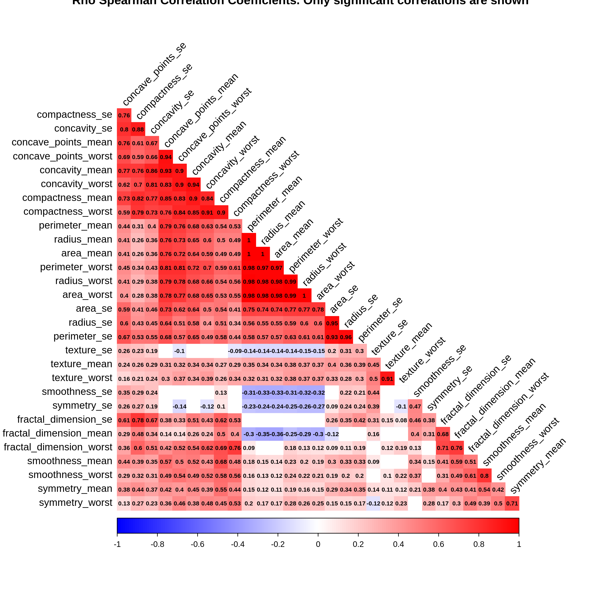
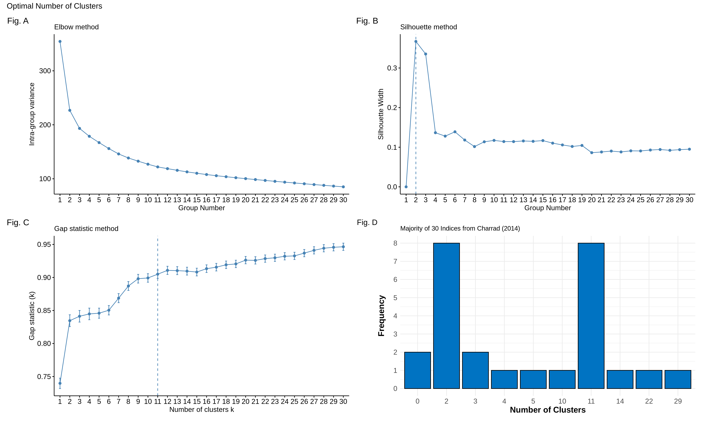
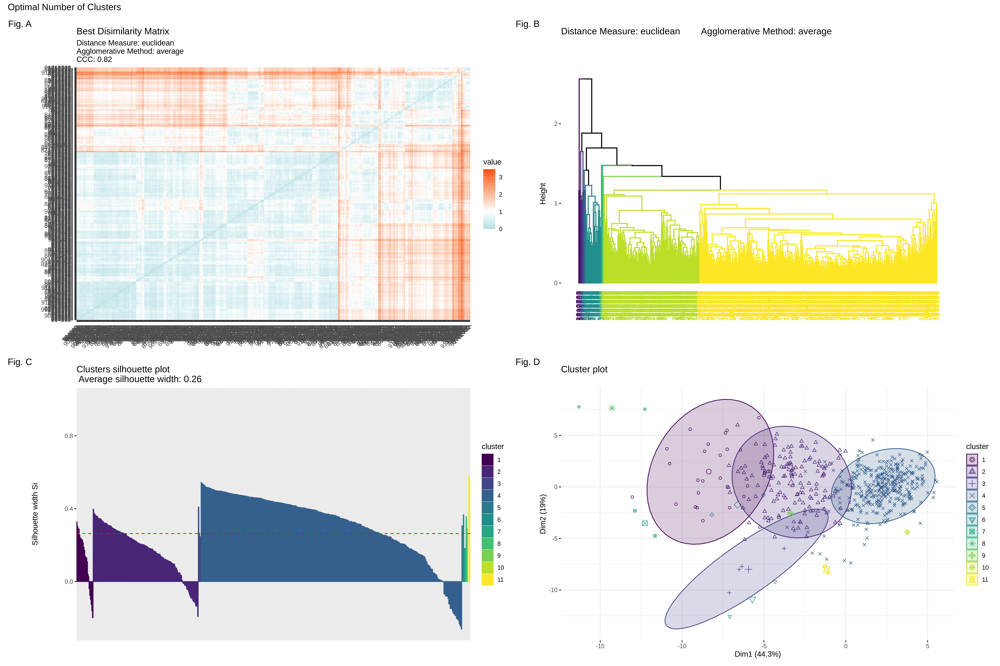

# Hierarchical Clustering and Metrics

## Overview
`hierarchical_clustering_and_metrics()` is an R function that automates a comprehensive hierarchical clustering analysis. It includes correlation calculations, data normalization, optimal cluster number determination, internal and external validation, and generates detailed reports and visualizations.

---

## Features
- Calculates correlations based on data type (Pearson, Spearman, or mixed).
- Normalizes numeric variables.
- Determines best distance metric and agglomeration method.
- Evaluates optimal cluster count using multiple methods:
  - Elbow method
  - Silhouette width
  - Gap statistic
  - NbClust indices
- Generates professional visualizations:
  - Correlation plots
  - Dendrograms
  - Silhouette plots
  - PCA plots
- Provides internal and external validation metrics.
- Exports Excel reports and plots.
---

## Function Usage
```r
hierarchical_clustering_and_metrics(
  metadata,
  vect.external.val = NULL,
  where_to_save = NULL,
  title = "Hierarchical_clustering",
  max_k_number = 30,
  nboot = 500,
  ties = "max"
)
```

### Parameters
- **metadata**: Data frame with numeric and/or categorical variables.
- **vect.external.val**: Optional vector with external labels for validation. Default: `NULL`.
- **where_to_save**: Directory to save results. Default: current working directory.
- **title**: Title for analysis and output directory names. Default: `"Hierarchical_clustering"`.
- **max_k_number**: Maximum number of clusters to evaluate. Default: `30`.
- **nboot**: Number of bootstrap iterations for gap statistic. Default: `500`.
- **ties**: Tie-breaking rule for cluster selection (`"max"` or `"min"`). Default: `"max"`.

### Returns
A data frame with cluster assignments for each observation. Additionally, Excel reports and plots are saved in the specified directory.

---

## Examples
```r
# Example with Breast Cancer UCI dataframe
url <- "https://archive.ics.uci.edu/ml/machine-learning-databases/breast-cancer-wisconsin/wdbc.data"

bcancer <- read.csv(url, header = FALSE)
colnames(bcancer) <- c(
  "ID", "Diagnosis",
  "radius_mean", "texture_mean", "perimeter_mean", "area_mean", "smoothness_mean",
  "compactness_mean", "concavity_mean", "concave_points_mean", "symmetry_mean", "fractal_dimension_mean",
  "radius_se", "texture_se", "perimeter_se", "area_se", "smoothness_se",
  "compactness_se", "concavity_se", "concave_points_se", "symmetry_se", "fractal_dimension_se",
  "radius_worst", "texture_worst", "perimeter_worst", "area_worst", "smoothness_worst",
  "compactness_worst", "concavity_worst", "concave_points_worst", "symmetry_worst", "fractal_dimension_worst"
)

bcancer <- bcancer %>%
  tibble::column_to_rownames(var = "ID") %>%
  select_if(function(x) is.numeric(x))

# Test hclust function
hierarchical_clustering_and_metrics(metadata = bcancer, 
                                    where_to_save = "Documentos/", 
                                    title = "Test1_Only_Numerical_DF")

```

---

## Visualizations

### Correlation Plot


### Optimal Number of Clusters



### Clustering Visualizations


---

## Output

### Directory Structure

```
<output_dir>/
├── 01_Correlations/
│   ├── Correlation_plot.png
├── 02_HClustering/
│   ├── 01_Optimal_Clusters_Determination.png
│   ├── 02_Validation_Clustering_Plots.png
│   └── Individual_Plots/
│       ├── 01_ElbowPlot.png
│       ├── 02_SilhouettePlot.png
│       ├── 03_Gap_StatisticPlot.png
│       ├── 04_Frequency_Optimal_Clustering.png
│       ├── 05_Best_Disimilarity_Matrix.png
│       ├── 06_HClust_Dendrogram.png
│       ├── 07_Silhouette_Width_Plot.png
│       └── 08_PCA.png
└── HC_Report.xlsx

```

---
## License
[MIT License](LICENSE)

---

## Contributing
Feel free to submit issues or pull requests to improve functionality or documentation.
